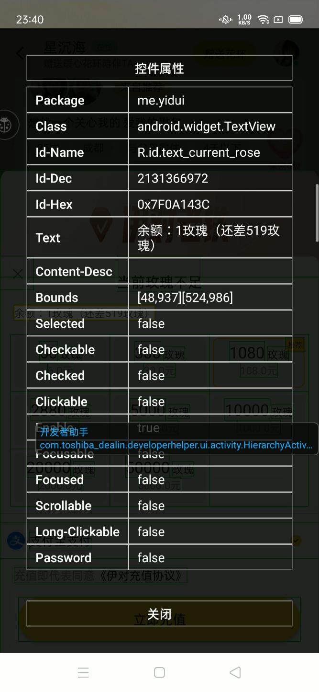

# 参考文章


# check


GDA扫描

```
[File Base Info]
File Name:	C:\mm_dqx\code\file\apk\app\yidui_8.1.400.apk
Package Name:	me.yidui
Main Activity:	com.yidui.ui.home.MainActivity
File Size:	108185764 bytes
MD5:		acb818c47d79de6ef254b8320669aba4
Packed:		Not Packed
Min SDK:	21
Target SDK:	33
```


drozer

```
drozer Console (v3.1.0)
dz> run app.package.attacksurface me.yidui
Attempting to run shell module
Attack Surface:
  27 activities exported
  7 broadcast receivers exported
  1 content providers exported
  15 services exported
```


# export activity测试


当我测试某个activity时，app疯狂吃我的流量。


```
C:/Users/tinyx/AppData/Local/Programs/Python/Python38/Lib/site-packages/drozer/modules/app/mmfuzz.py

run app.activity.start --component me.yidui com.yidui.ui.live.love_video.LoveVideoActivity

run app.activity.start --component me.yidui com.yidui.ui.home.MainActivity

run app.activity.start --component me.yidui com.yidui.ui.login.PhoneAuthActivity

run app.activity.start --component me.yidui com.yidui.ui.login.NewUIBaseInfoActivity

run app.activity.start --component me.yidui com.yidui.ui.message.activity.TagsInfosActivity

run app.activity.start --component me.yidui com.yidui.ui.me.UploadAvatarActivity

run app.activity.start --component me.yidui com.yidui.ui.me.avatar.BeautyCameraActivity

run app.activity.start --component me.yidui me.yidui.wxapi.WXEntryActivity

run app.activity.start --component me.yidui me.yidui.wxapi.WXEntryActivity

    Target Activity: me.yidui.wxapi.WXEntryActivity
run app.activity.start --component me.yidui com.yidui.ui.member_detail.MemberDetailActivity

run app.activity.start --component me.yidui com.yidui.ui.live.base.BaseLiveRoomActivity

run app.activity.start --component me.yidui com.yidui.ui.live.beauty.BeautyPriviewActivity

run app.activity.start --component me.yidui com.yidui.ui.live.video.LiveInviteDialogActivity

run app.activity.start --component me.yidui com.yidui.ui.live.love_video.LoveVideoInviteDialogActivity

run app.activity.start --component me.yidui com.yidui.ui.live.pk_live.PkLiveInviteDialogActivity

run app.activity.start --component me.yidui com.yidui.ui.live.video.LiveSevenInviteDialogActivity

run app.activity.start --component me.yidui com.yidui.ui.message.activity.RelationshipActivity

run app.activity.start --component me.yidui com.yidui.ui.message.activity.RelationshipEscalationActivity [+]

run app.activity.start --component me.yidui com.yidui.business.moment.ui.activity.MomentTopicDetailActivity [+]

run app.activity.start --component me.yidui com.yidui.feature.live.open.ui.CreateLiveRoomActivity  [+]

run app.activity.start --component me.yidui com.bytedance.android.openliveplugin.stub.activity.DouyinAuthorizeActivityProxy [白屏]

run app.activity.start --component me.yidui com.bytedance.android.openliveplugin.stub.activity.DouyinAuthorizeActivityLiveProcessProxy [白屏]

run app.activity.start --component me.yidui com.alipay.sdk.app.PayResultActivity

run app.activity.start --component me.yidui com.alipay.sdk.app.AlipayResultActivity

run app.activity.start --component me.yidui com.igexin.sdk.GetuiActivity

run app.activity.start --component me.yidui com.xiaomi.mipush.sdk.NotificationClickedActivity

run app.activity.start --component me.yidui com.bytedance.ads.convert.BDBridgeActivity

```


# 异常流量


# 聊天券


# 支付漏洞


他的每日任务是DetailWebViewActivity，


