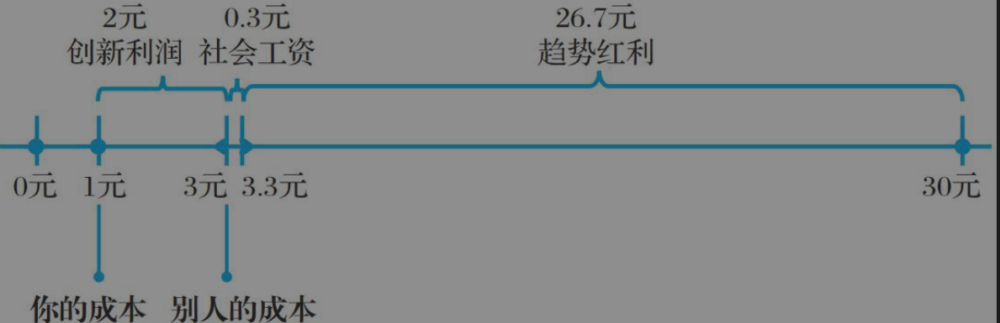

# 作者简介

刘润润米咨询创始人，微软前战略合作总监，《5分钟商学院》主理人，任腾讯、百度、海尔、恒基地产、中远国际、晨兴资本、康宝莱、拍拍贷等多家企业的战略顾问，香港上市公司恒富控股独立董事，互联网转型专家。著有畅销书“每个人的商学院”系列、“5分钟商学院”系列、《新零售》《2012，买张船票去南极》《人生，就是一场突如其来的旅行》《互联网＋：小米案例版》《趋势红利》《商业洞察力》《商业简史》等。

# 书摘

**一个人心中，应该有三种“对错观”：**

- ①法学家的对错观，法律角度。

- ②经济学家的对错观，社会成本损失角度。

- ③商人的对错观。个i人损失角度。

    

---

**人与人之间的差距来自哪里？**来自是否拥有智慧，以及拥有什么层次的智慧。在人生中，博弈是第三层智慧，定力是第二层智慧，选择是第一层智慧。如何博弈，如何保持定力，如何做出选择，都决定着人生的走向——选择做某件事情，凭借长期主义形成自己的定力，和这个世界重复博弈。

---

罗曼·罗兰的一句话了：“这个世界上，只有一种真正的英雄主义，那就是认清了生活的真相后还依然热爱它。”

---

在学习经济学之前，我希望你能先记住三句名人名言。

第一句是菲兹杰拉德说的：“同时持有全然相反的两种观念，还能正常行事，是第一流智慧的标志。”这样，你才会懂得，学李白，也要学杜甫。

第二句是罗曼·罗兰说的：“这个世界上，只有一种真正的英雄主义，那就是认清了生活的真相后还依然热爱它。”这样，你才有勇气给每个模型找个反例，然后继续用这个模型。

第三句是查理·芒格说的：“如果我不能比这个世界上最聪明的人更能反驳这个观点，我就不配拥有这个观点。”这样，你才能时刻提醒自己，每个理论都有前提。

---

**一个人的表述大概可以分为四种：事实(Fact)、观点(Opinion)、立场(Stand)和信仰(Belief)。**

事实：独立于人的判断的客观存在。

观点：是你对一个事实的看法。观点和你的关系，比它和事实的关系更加密切。

立场：被位置和利益影响的观点。

信仰：是一套完全自洽的逻辑体系。

---

**注射式洗脑：为什么+观点。**

为什么胖的人相对比较懒？为什么电子产品越来越便宜，衣服鞋子却越来越贵？为什么书上说的激励手段都没用？为什么懂了那么多道理，还是过不好这一生？为什么爱因斯坦晚年改信上帝了？

“为什么+观点”语句常常让人去关注为什么的原因，而忽略了观点的真实性。

比如 “为什么他老是针对我？”。尽管对方没有针对你，你也会去想 他针对你的原因。

---

**普通和优秀的差距，在于解决问题的方式不同。**

制度，是规定，是契约，关注的是结果；

流程，是基于时间线做一件事的过程，关注的是过程；

系统，是内部各个要素、变量之间相互关系、相互作用的整体，关注的是各要素之间的关系。

无论是流程、制度，还是系统，其实都是用来解决问题的。普通的人改变结果，优秀的人改变原因，顶级优秀的人改变模型。

改变制度是改变结果，改变流程是改变原因，改变系统则是改变模型。

---

**逻辑思维与逻辑闭环**

一个人如果有基本的逻辑思维，就会有刨根问底的好奇心，遇到事情不满足于表面的解释，而是不断地往下追溯，找到根本原因。

- 看起来怎么样 （事情表象）
- 为什么会这么样（找根本解）
- 以前是这么样的 （追本溯源）
- 还有什么样的 （举一反三）

---

**复利思维**

复利是一个长期的过程，如果能忍受长期的等待，那么复利大概就会起作用。

财富自由的三种方法——

- “无欲无求式财富自由” : 能或者就很满足了。
- “三生三世式财富自由” ：类似于复利效应，需要一个很漫长的过程才会财富自由。
- “第一桶金式财富自由”：有很多本钱，通过本钱去赚更多的钱。

**早期靠本金，后期靠复利**

几点建议：

一是尽早存到足够的本金。获得财富自由的第一重要的事，是培养赚钱的能力。赚钱要靠本金，而不是靠复利。你都没有本金，哪来的钱生钱呢？

二是努力做到稳健高收益。找到高收益的投资不难，识别背后的风险很难。你看中的是别人的利息，别人看中的是你的本金。

三是让时间证明它的力量。要有把压岁钱存成养老金的足够耐心，认清复利效应从来都不是暴富的手段。

四是降低自身的贪念与欲望。不要看到别人买了车，就要买游艇；看到别人买了游艇，就要买专机。欲望是无法填平的，只能降低。

做到以上这几点，你才能离财富自由更近一些。

---

**五种数学思维**

数学不难，真的不难。你不一定要会解大部分数学题，不一定要能背下来所有的公式，不一定要在数学考试中拿满分，但是你至少要训练自己的数学思维。训练数学思维，是为了让自己拥有符合规律的思维方式。

》概率论（从不确定性中找到确定性）:

 “正确的事情，要重复做”，这其实就是概率论的通俗表述.

如果一件事情成功概率是20%。失败的概率就是80%。

80%^n^=1-95%=5%=0.05 ,当n=14时，你成功至少1次的概率就可以达到95%。

》微积分: “用动态的眼光看问题” ,

加速度的时间累积是速度，速度的时间累积是距离。

你今天晚上努力学习了，但是一晚上的努力，并不会直接变成你的能力。你的努力，得累积一段时间，才会变成你的能力。而你有了能力，并不会马上做出成绩。你的能力，得累积一段时间，才会变成你的成绩。而你有了一次成绩，并不会马上得到领导的赏识。你的成绩，得累积一段时间，才会使你得到领导的赏识。

从努力到能力，到成绩，到赏识，是有一个过程的，有一个积分的效应。

微积分的思维方式，从本质上来说，就是用动态的眼光看问题。一件事情的结果，并不是瞬间产生的，而是长期以来的积累效应造成的。出了问题，不要只看当时那个瞬间，你只有从宏观一直追溯（求导）到微观，才能找到问题的根源所在。

》公理体系

在几何学中，一旦制定了不同的公理，就会得到完全不同的知识体系。这就是“公理体系”思维。

》向量：数字的方向性

假如你拖着一个箱子往东走，你的力气很大，有30牛顿。这时来了一个人，非要跟你对着干，把箱子往西拉，他力气没你大，只有20牛顿。结果如何呢？这个箱子还是会跟着你往东走，只不过只剩下10牛顿的力，它的速度会慢下来。

》全局最优和达成共赢

源于博弈论。

在零和博弈中，你要一直保持清醒：你要的是全局的最优解，而不是局部的最优解。

在非零和博弈中，讲究的是共赢。共赢的前提，是建立信任。为什么建立信任？因为大家都需要做出让步。

---

凡事要顺势而为，用“个位”的管理对抗“千位”的时代，如同螳臂当车。徐小平老师说得很好：“你首先选择行业，然后选择公司，否则你就是在泰坦尼克号的头等舱，再豪华也终将沉没。”
#

**人生商业模式=能力×效率×杠杆 。**

》能力：最牛的能力应该是获取能力的能力。就像是学会学习，而不是学会一个常认为的技能。如何获取能力？高效而可怕的勤奋，或者称之为刻意练习。在2年内获得别人5年的能力 ，**【加班，通宵，高效反馈】**。得注意在身体可接收范围之内。

》效率：**选择，是提高效率的第一要义**。如果做A需要1小时，做B需要2小时。做A显然可以省下1小时，但这前提是AB两件事情在回报上是差不多的。于是我们就顺利的回归到一件事情之上，那就是选择做什么事情最划算了。然后是在已选择的事情之上高效的完成它。如何高效呢？**借助方法和工具**。

总结而言，怎么才能提高做事情的效率？第一要义，是选择做那些对你来说最最重要的事情。然后，使用更高效的方法、更称手的工具。

》4种杠杆：团队杠杆、产品杠杆、资本杠杆、影响力杠杆

团队杠杆：找一群优秀的人帮你干活。#
产品杠杆：把你的产品变得可以高效的复制。

资本杠杆：拉人投资呗

影响力杠杆：让别人相信你，认可你。

人生，是一种商业模式。想要获得成功，就看你能拥有多少能力，达到多高效率，以及使用哪些杠杆。有的人，用它们换回了全世界，而有的人，却一无所获。

---

有些人，不分白天晚上，一直在工作，一直在玩，对于这样的人而言，玩和工作是浑然一体的。正是因为他们对工作有热情，主动赋予工作崇高的意义和无限的乐趣，才能拥有这么高的成就。

让一些他人不太理解的行为成为你的一种习惯，自然而然的就没关系了。

习惯不会让人痛苦，养成习惯的过程才会让人痛苦。

史蒂芬·柯维说过：“想法产生行动，行动养成习惯，习惯变成性格，性格决定命运。”

---

边际交付时间为零的叫产品；边际交付时间不为零的，边际交付时间越高的，越是服务。并不是说服务不赚钱，而是赚钱的速度赶不上产品。

---

你能帮到的人才是你的人脉资源。君子之交淡如水，好的人际关系，没有必要天天一起吃饭，或者逢年过节送个礼。

当你没钱、没资源、没背景的时候，唯有你的实力、业绩、作品，才是让你在绝境之中脱颖而出的最佳武器。

没有真本事，无法帮助到别人，就算你认识的人再多，他们也不会是你的人脉。

人脉的本质，是平等交换。

真正的人脉，就是10-30-60 。 10：能借到钱的人，30：能经常打交道的人(含前10人)，60：熟悉的人（含前30人）。	 

---

知识、技能与态度。

知识：知识就是已经被发现和证明的规律。它是确定的，不需要你通过自身的成功、挫败去验证，然后恍然大悟。需要记忆。

技能：技能就是那些你以为你知道，但如果你没做过就永远不会真的知道的事情。需要练习。

态度：看待事物的有色眼镜。

---

自污、示弱、看淡。

---

灵魂三问：what，why，how。

做一件事情，这件事情有没有做，有没有一直做，都和是否正确理解到（what，why，how）有关系。就比如你有没有天天运动。

What、Why、How，是“黄金三问”，密不可分。

没有Why，就没有动力，What和How也就没有意义。

没有How，就只是鸡汤，再多道理也只是体现在纸面上。

---

这张图有点意思。

趋势红利：来自运气，社会非常需要这个产品，同时在做该产品的也不是很多人。

社会工资：大家都在吃趋势红利，不可避免的会打价格战来获取市场份额。最后价格低到离谱，同时社会依然需要该产品，于是社会就会维护一个价格，让一个产品至少能够有利润活下去。

创新利润：大家都卖3元，同时质量上也没什么差距，于是创新就成为了突破口。你制作成本1元，别人要3元，那么2元就是你独有的利润。

所以当我们在讨论利润时，哪些利润是我们真正把握在手中的，要有一个清晰的认识。只有别人拿不走的，才是你真正的利润。

---

关于公司KPI，员工薪资。

没有了后顾之忧，员工才能够发挥最大的创造性。

而且，你一旦给员工一份高的固定工资，其实反而能激发他的善意。

你要相信人性的善，人不是靠激励做事的，人自身就有成长的动力。一个人觉得安全了，不用为钱发愁了，他反而会去做一些真正有价值的事情。

脑子里天天想着钱的人，是干不出漂亮事的。

---

员工和企业是雇用关系，但雇用关系的本质，是某种形式的合伙关系，是一种共同体。这种合伙关系有三种形态：利益共同体、事业共同体、命运共同体。

利益共同体：类似于流水线计件的那种关系，做得多，工作就拿得多。

事业共同体：看种长期利益的，会愿意牺牲现有的利益，而去获取有风险，长期，且回报大的利益。

命运共同体：在事业共同体的基础上，甚至愿意出资。

---

财富=劳动×生产率×需求。

劳动：人力资源。

生产率：取决于很多因素，比如知识、科技、工具、机器、流程、方法……这些东西，共同决定了你创造财富的生产率。

需求：产品得卖得出去。

劳动可以创造财富，创造财富很重要，但是财富应该怎么分配、谁应该比谁更有钱这件事，并不是由创造财富的人决定的，而是由掌握稀缺资源的人决定的。所以，如果你想要拥有更多财富，就应该想尽一切办法，提高自己的稀缺性。比如，对于个人来说，你要思考的问题应该是：——我是否拥有非常稀缺的能力？——我是否在公司最稀缺的部门？——我是否在部门最稀缺的岗位？——我是否拥有最稀缺的资源？——我现在拥有的稀缺性，未来还能继续稀缺吗？

为什么有些员工年轻的时候能赚很多钱，35岁以后就容易被裁员？因为这些员工的体力和学习能力都没有年轻人强，要价还比年轻人高，他们已经变得不稀缺了，慢慢地，就容易被淘汰。所以，为了避免被淘汰，你要提前去思考怎么提高自己未来的稀缺性。而对于公司来说，你要思考的问题应该是：——我是否拥有非常稀缺的能力？——我是否拥有最稀缺的资源？——我是否处于最稀缺的行业？——我是否在行业中处于最稀缺的节点？——我现在拥有的稀缺性，未来还会继续稀缺吗？只有不断让自己变得稀缺，你才能拥有财富分配权，获得更多财富。

---

公平——用“同一把”尺子丈量万物，但抛开尺子，依然会存在很多不同的影响因素。

公正——选“哪一把”尺子来丈量，公正的本质不是“你对我错”的问题，而是“谁有权来选尺子”的问题。

公开——把丈量的过程展示给公众，让同意公正者监督公平。

---

效率与公平，最好的资源得给用得最好的人，一些普通人就会感到不公。

管理者就会制订规则，降低那些厉害的所获取的利益，然后拿来分给那些普通的人。

